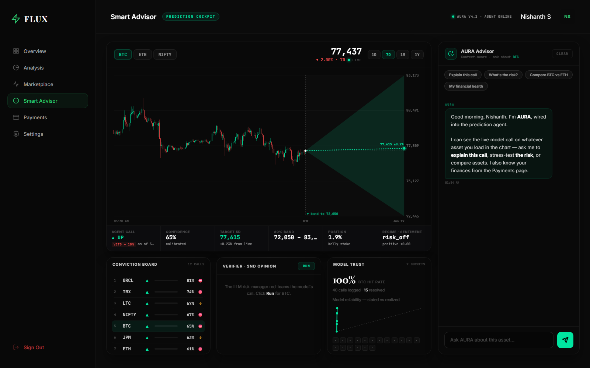
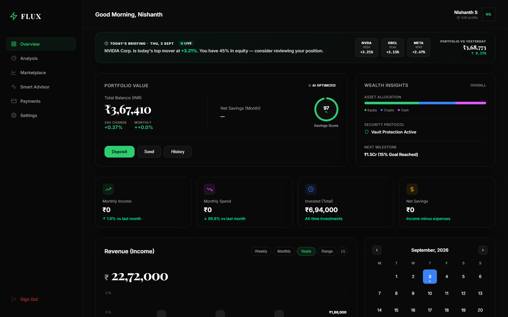
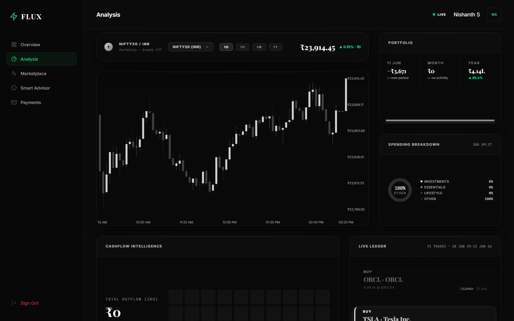
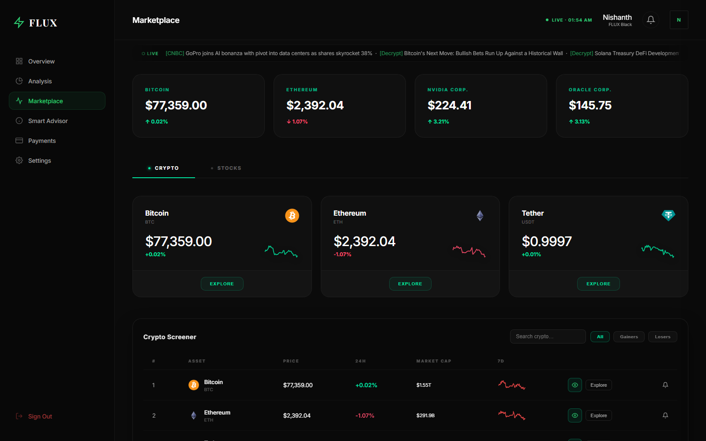
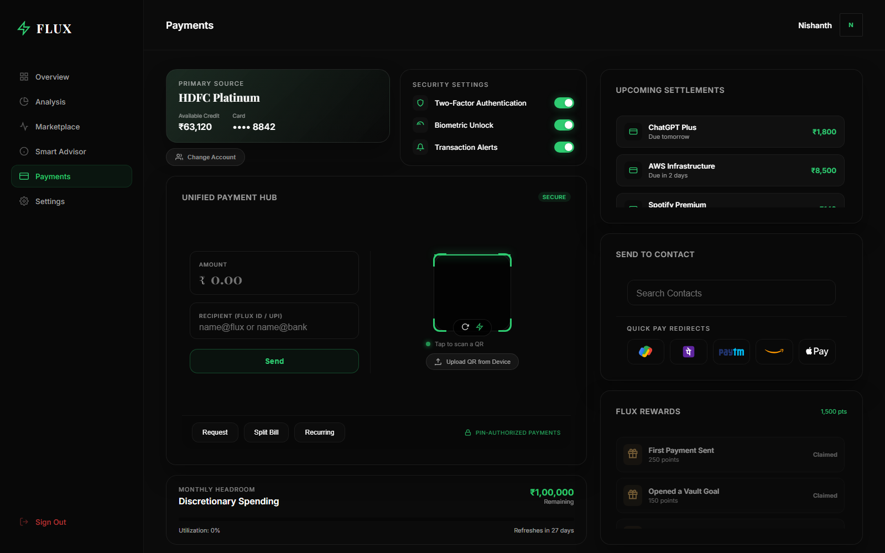

<div align="center">

# FLUX — Agentic Finance System

**An AI-powered finance platform: a calibrated machine-learning market-prediction agent behind a full digital-wallet experience.**

[](https://github.com/nishanthsr7-eng/FLUX-Agentic_Finance_System/actions/workflows/ci.yml)
[](LICENSE)
[](https://www.python.org/)
[](https://fastapi.tiangolo.com/)
[](https://xgboost.readthedocs.io/)
[](#disclaimer)
[](https://nishanth-flux.pages.dev)

</div>

<p align="center">
  
</p>

---

## Live demo

**[nishanth-flux.pages.dev](https://nishanth-flux.pages.dev)**

Sign in with the demo account to see the seeded portfolio, trade history and
prediction cockpit, or register your own from the sign-up page:

| | |
|---|---|
| Email | `nishanth@flux.app` |
| Password | `FluxDemo@123` |

Frontend on Cloudflare Pages, API on Render, MySQL on TiDB Serverless.

> The API runs on a free instance. If it has been idle, the first request may
> take up to a minute to wake it — the dashboard fills in once it responds.

---

FLUX unifies live market data, portfolio management, paper trading, and a
stock/crypto trend-prediction agent into a single web application.

The platform is built around an **honesty contract**: the prediction engine is
engineered to be measurably better out-of-sample than a typical tutorial
pipeline by *refusing to leak the future into training* and by *quantifying its
own uncertainty correctly* — not by promising impossible accuracy.

In practice that means purged, embargoed walk-forward cross-validation;
triple-barrier labeling; fractional differentiation tuned by ADF test;
probability calibration; GARCH-shaped conformal prediction bands; and an LLM
verifier with veto power over the model's own call.

---

## Screenshots

### Smart Advisor — the prediction cockpit

The agent's directional call, calibrated confidence, Kelly-sized position, and
the GARCH-shaped 80% conformal band projected forward from live price. The
conviction board ranks every tracked asset; **Model Trust** plots stated
confidence against realized hit rate.



### Dashboard — portfolio overview

Live briefing on the day's top mover, portfolio value, asset allocation, and
cashflow — all backed by the seeded MySQL dataset scoped to the signed-in user.



### Analysis — live charting and cashflow intelligence

Real-time candlestick charting across timeframes, spending breakdown, and the
live paper-trading ledger.



### Marketplace — live crypto and equity screener

Streaming quotes, sparklines, market caps, and a headline ticker fed by the
background ingestion scheduler.



### Payments — unified payment hub

Multi-account payment routing, QR flows, recurring settlements, contact
transfers, and a discretionary-spending headroom meter.



---

## Documentation

| Document | Purpose |
|---|---|
| [docs/SETUP.md](docs/SETUP.md) | Full local installation and run instructions |
| [docs/DEPLOYMENT.md](docs/DEPLOYMENT.md) | Deploy the full stack on free tiers |
| [docs/DEPLOYMENT_RECORD.md](docs/DEPLOYMENT_RECORD.md) | What is deployed, where, and the problems hit getting there |
| [docs/FEATURES.md](docs/FEATURES.md) | Complete feature catalogue |
| [docs/PAGES.md](docs/PAGES.md) | Every frontend page and what it does |
| [docs/ARCHITECTURE.md](docs/ARCHITECTURE.md) | System architecture, modules, data flow |
| [docs/API_KEYS.md](docs/API_KEYS.md) | How to obtain every API key |
| [docs/DATASETS.md](docs/DATASETS.md) | How to download every training dataset |
| [docs/API_REFERENCE.md](docs/API_REFERENCE.md) | Backend HTTP endpoint reference |
| [docs/AGENT_TRAINING.md](docs/AGENT_TRAINING.md) | How the prediction agent is trained |

---

## Technology Stack

**Frontend**
- HTML5, vanilla CSS (design-token system), vanilla JavaScript (ES modules)
- `live-server` for local development on port 3000

**Backend**
- Python 3.10+
- FastAPI + Uvicorn (ASGI web framework and server)
- APScheduler (`AsyncIOScheduler`) for background ingestion and prediction jobs
- `httpx` async HTTP client; `yfinance` for market data

**Persistence**
- SQLite via `aiosqlite` (live market data, predictions, outcomes)
- MySQL via `pymysql` (seeded application dataset for user-facing pages)
- ChromaDB (vector store for Retrieval-Augmented Generation)

**Machine Learning / Prediction Agent**
- XGBoost (gradient-boosted direction classifier)
- scikit-learn (calibration, metrics, linear base learners)
- `hmmlearn` (Gaussian HMM regime detection)
- `arch` (GARCH(1,1) volatility), `statsmodels` (ADF test, ARIMA baseline)
- `transformers` + `torch` (FinBERT / CryptoBERT sentiment)
- `chronos-forecasting` (zero-shot foundation-model baseline)
- In-house fractional differentiation, triple-barrier labeling, purged
  walk-forward cross-validation, and conformal prediction bands

**LLM Reasoning Layer**
- Ollama serving a local model (`aura`) for explanation and the verifier/veto layer
- Optional hosted-LLM API upgrade for stronger reasoning

---

## Quick Start

```bash
# 1. Frontend dependencies
npm install

# 2. Backend dependencies (use a virtual environment)
pip install -r backend/requirements.txt

# 3. Configure secrets — copy the template and fill in your keys
cp .env.example .env          # Windows:  copy .env.example .env

# 4. Start the backend API (port 8000)
npm run api                   # or: uvicorn backend.main:app --reload --port 8000

# 5. Start the frontend (port 3000) in a second terminal
npm run dev
```

Open <http://localhost:3000>. The backend health probe is at
<http://localhost:8000/health>.

Every key in `.env.example` is optional — FLUX degrades gracefully, and a
missing key disables only the feature that needs it. For the complete
walkthrough, including MySQL seeding, Ollama setup, dataset download, and model
training, see [docs/SETUP.md](docs/SETUP.md).

---

## Tests

The prediction agent ships with unit suites covering feature engineering,
leakage guards, the ensemble, and portfolio construction:

```bash
pytest backend/prediction -q
```

CI runs these on Python 3.10 and 3.12 on every push and pull request.

---

## Repository Layout

```
.
├── index.html              # Landing page
├── pages/                  # Application pages (dashboard, marketplace, ...)
├── css/                    # Design-token-based stylesheets
├── js/                     # Frontend JavaScript modules
├── backend/                # FastAPI application
│   ├── main.py             # API routes + app wiring
│   ├── ingestion.py        # APScheduler ingestion jobs
│   ├── insights.py         # LLM market-insight generation
│   ├── rag.py              # ChromaDB embedding + retrieval
│   ├── db.py / mysql_db.py # SQLite + MySQL persistence
│   ├── auth.py             # Login / register / sessions
│   ├── trading_api.py      # Paper trading, watchlist, alerts
│   ├── payments_api.py     # Payments page writes
│   └── prediction/         # The machine-learning prediction agent
├── scripts/                # Dataset download + training/eval gate scripts
├── Dataset/                # Staged training datasets (downloaded locally)
├── ai_engine/              # Ollama model files
├── mcp/                    # Model Context Protocol server
└── docs/                   # This documentation set
```

---

## Disclaimer

FLUX is a research and educational platform. The prediction agent produces
*calibrated decision support*, not financial advice or an oracle. All trading
functionality is **paper trading only**; the system never executes live trades
or moves real money. Markets are near-efficient — realistic directional
accuracy on daily bars has a hard ceiling. Do not risk capital based on this
software.

---

## License

[MIT](LICENSE) © Nishanth S
